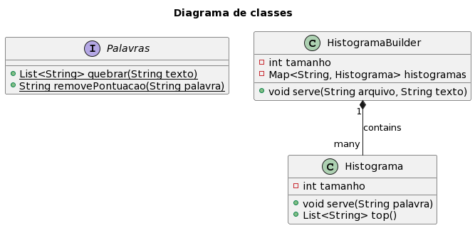

# Crie um consumidor simples que lê as mensagens de um tópico

Agora para criar o nosso consumidor, vamos pular a parte de criar um projeto, já aprendemos isso no [Dia 002](../dia-002/README.md). A ideia de hoje é criar um histograma simples por arquivo. Esse histograma não vai ter uma memória persistente, isso significa que só carregará as palavras recebidas e contará a sua incidência. Então para alcançar nosso objetivo precisamos.

1. Projetar classes para criar histograma
2. Validar que esteja funcionando
3. Integrar com consumer

## 1. Projetar classes para criar histograma

Antes de começar a implementar nós precisamos entender o que é um histograma. Podemos descrever um histograma como um gráfico de frequência, ou seja, nosso histograma de um texto deve ter uma entrada para cada palavra e associada a palavra a quantidade de vezes que ela apareceu no texto.

No Dia 002, nós criamos um produtor que lê de um determinado arquivo envia linha a linha pelo tópico `texto` usando o nome do arquivo como chave e a linha como mensagem. Então nós precisamos projetar ao menos 3 classes. 

A primeira será o coração da funcionalidade, a **Histograma**, ela deve receber palavras e alimentar um contador interno para cada palavra, depois quando requisitarmos as palavras mais frequentes deve retornar uma lista ordenada.

A segunda não será uma classe, mas uma função para quebrar texto em palavras. Como Java é Orientado a Objetos, não dá pra criar uma função pura, então para atingir esse objetivo vamos criar uma interface para implementar essa função. Essa interface terá todas as funções para tratamento de **Palavras**.

E por fim teremos o construtor de Histogramas, essa classe ficará responsável por criar um histograma para cada arquivo. Essa classe se chamará **HistogramaBuilder** e será o ponto de contato entre nossos histogramas e o nosso consumidor.

<!--
@startuml
title
Diagrama de classes
end title

interface Palavras {
 + {static} List<String> quebrar(String texto)
 + {static} String removePontuacao(String palavra)
}

class Histograma {
 - int tamanho
 + void serve(String palavra)
 + List<String> top()
}

class HistogramaBuilder {
 - int tamanho
 - Map<String, Histograma> histogramas
 + void serve(String arquivo, String texto)
}

HistogramaBuilder "1" *-- "many" Histograma : contains
@enduml
-->


## 2. Validar que esteja funcionando

Como não é tão simples testar usando Apache Kafka, vamos garantir que nossas classes estão funcionando, para isso adicionamos alguns testes usando JUnit 5. Verifique o arquivo HistogramaTest para ver quais testes adicionamos.

Para configurar no maven, basta adicionar as dependências relacionadas ao JUnit e os plugins `maven-surefire-plugin` e `maven-failsafe-plugin`. Para entender melhor, compare o pom.xml de hoje com o do Dia 002,

O arquivo deve ficar localizado em uma pasta especial também:

```
.
├── src
|   ├── java
│   │   └── java
│   │       └── io
│   │           └── vepo
│   │               └── histograma
│   │                   ├── Histograma.java
│   │                   ├── HistogramaBuilder.java
│   │                   └── Palavras.java
│   └── test
│       └── java
│           └── io
│               └── vepo
│                   └── histograma
│                       └── HistogramaTest.java
└── pom.xml
```

Para executar os testes sem a ajuda da IDE, execute:

```bash
mvn clean test
```

## 3. Integrar com consumer

Agora nós precisamos criar um programa que:

1. Carrega todas as configurações necessárias
2. Instancia o consumer
3. Subscreve no tópico desejado
4. Processa mensagens

### 3.1. Carrega todas as configurações necessárias

Para se criar um consumidor, existem algumas configurações que são similares ao produtor, única obrigatória é definir qual broker devemos conectar, por isso usamos o [`bootstrap.servers`](https://kafka.apache.org/documentation/#consumerconfigs_bootstrap.servers).

Outras configurações são análogas (isso é, tem funções parecidas mas não iguais) como o deserializador. No produtor definimos o serializador da chave e da mensagem, aqui vamos definir o deserializador da chave e da mensagem usando as respectivas mensagens: [`key.deserializer`](https://kafka.apache.org/documentation/#consumerconfigs_key.deserializer) e [`value.deserializer`](https://kafka.apache.org/documentation/#consumerconfigs_value.deserializer).

Para ter uma configuração mínima para um consumidor ainda precisamos definir mais duas configurações que eu espero que sejam facilmente compreendidas.

A primeira delas é o [`group.id`](https://kafka.apache.org/documentation/#consumerconfigs_group.id). Quando nós falamos de Apache Kafka, quase tudo funciona em modo cluster, o consumidor é um deses elementos da arquitetura que formam um cluster. Ao iniciar várias consumidores, eles entrarão em contato com os brokers e criarão um cluster de consumidores identificados pelo `group.id`. Isso significa que consumidores com a mesma função devem usar o mesmo `group.id`. Outra peculiaridade é que o cluster Kafka irá se encarregar que cada cluster de consumidores identificado por um id receba uma mensagem apenas uma vez. Complicado, né?! Em alguns dias vai ficar simples.

> **Aviso**
> Antes da primeira execução, é recomendável que você tenha executado o programa do Dia 002 que fará a ingestão de dados. E depois de consumidos os mesmos não estarão disponíveis para o mesmo `group.id`, então você tem duas possibilidades:
> 1. Executa novamente o programa do Dia 002
> 2. Muda o `group.id`

A outra propriedade é mais simples. Imagina que nosso consumidor vai inciar seu consumo sem saber de onde deve começar a consumir, se pelas mensagens mais antigas ou as mais novas. Para resolver esse problema, configure a propriedade [`auto.offset.reset`](https://kafka.apache.org/documentation/#consumerconfigs_auto.offset.reset), ela aceita os valores:
* **latest**: Se não houver offset anterior, ignora todas as mensagens e só consome as mais recentes.
* **earliest**: Se não houver offset anterior, inicia pela mensagem mais antiga.
* **none**: Se não houver offset anterior, lança uma exceção.

É importante definir o `auto.offset.reset` porque o valor padrão é **latest**, o que pode ocasionar a perca de dados.

```java
props.put(ConsumerConfig.BOOTSTRAP_SERVERS_CONFIG, "localhost:29092");
props.put(ConsumerConfig.GROUP_ID_CONFIG, "histograma");
props.put(ConsumerConfig.AUTO_OFFSET_RESET_CONFIG, "earliest");
props.put(ConsumerConfig.KEY_DESERIALIZER_CLASS_CONFIG, StringDeserializer.class);
props.put(ConsumerConfig.VALUE_DESERIALIZER_CLASS_CONFIG, StringDeserializer.class);

try (var producer = new KafkaProducer<String, String>(props)) {
    // [código]
}
```

### 3.2. Instancia o consumer

Eu resolvi adicionar uma sessão só para falar sobre como se instancia o KafkaConsumer porque as aplicações de consumer em muitos casos são especificas e merecem algo que vou chamar de _soft shutdown_.

Sempre que o sinal de finalizar processo é recebido por um programa, uma sinalização é enviada, se não for respondida o programa é finalizado pelo sistema operacional. Existem alguns códigos para essas finalizações, mas elas não são importantes em Java pois a biblioteca padrão expõe uma API para lidar com ela. Quando um [SIGTERM](https://pt.wikipedia.org/wiki/SIGTERM), ele usa o [Shutdown Hook](https://docs.oracle.com/en/java/javase/18/docs/api/java.base/java/lang/Runtime.html#addShutdownHook(java.lang.Thread)) cadastrado no Runtime. Ao receber um SIGTERM, a thread de consumo deve finalizar o KafkaConsumer e depois informar a JVM que está pronta para finalizar, para isso usei duas classes utilitárias para controle de concorrência [`AtomicBoolean`](https://docs.oracle.com/en/java/javase/18/docs/api/java.base/java/util/concurrent/atomic/AtomicBoolean.html) e [`CountDownLatch`](https://docs.oracle.com/en/java/javase/18/docs/api/java.base/java/util/concurrent/CountDownLatch.html).

```java
var props = new Properties();
var running = new AtomicBoolean(true);
var finalizado = new CountDownLatch(1);
Runtime.getRuntime().addShutdownHook(new Thread(() -> {
    running.set(false);
    try {
        finalizado.await();
    } catch (InterruptedException e) {
        Thread.currentThread().interrupt();
    }
}));
// Adiciona propriedades

try (var consumer = new KafkaConsumer<String, String>(props)) {
    // subscreve
    while (running.get()) {
        // consome mensagens
    }
}

System.out.println("Consumidor finalizado!");
finalizado.countDown();
```

Dessa forma, quando o programa é finalizado temos a certeza que o KafkaConsumer é finalizado corretamente.

### 3.3. Subscreve no tópico desejado

Subscrever ao tópico deseja pode ser uma operação simples, mas ela tem uma gama de possibilidades. Você vai ver que estamos passando uma lista de tópicos, isso porque o consumer exige uma [lista](https://kafka.apache.org/31/javadoc/org/apache/kafka/clients/consumer/KafkaConsumer.html#subscribe-java.util.Collection-) ou uma [expressão regular](https://kafka.apache.org/31/javadoc/org/apache/kafka/clients/consumer/KafkaConsumer.html#subscribe-java.util.regex.Pattern-org.apache.kafka.clients.consumer.ConsumerRebalanceListener-).

```java
consumer.subscribe(Arrays.asList("texto"));
```

### 3.4. Processa mensagens

Por fim, para processar as mensagens precisamos primeiro chamar a operação [poll](https://kafka.apache.org/31/javadoc/org/apache/kafka/clients/consumer/KafkaConsumer.html#poll-java.time.Duration-). Um poll é uma operação bloqueante, mas tem um limite máximo de tempo, se nenhuma mensagem foi encontrada, ela retornará uma lista vazia. 

```java
consumer.poll(Duration.ofSeconds(1L))
        .forEach(record -> builder.serve(record.key(), record.value()));
```

Você verá na documentação que retorna um objeto da classe [ConsumerRecords](https://kafka.apache.org/31/javadoc/org/apache/kafka/clients/consumer/ConsumerRecords.html) que nada mais é do que uma lista de [ConsumerRecord](https://kafka.apache.org/31/javadoc/org/apache/kafka/clients/consumer/ConsumerRecord.html). A classe ConsumerRecord é bem interessante e vale a pena ver os métodos presente nela para conhecer as informações que o Kafka retorna junto de uma mensagem, mais a frente vamos detalhar cada uma.

## 4. Logging

No arquivo [logback.xml](./consumidor/src/main/resources/logback.xml) está definida as configurações de log. Eu deixei com o nível de log em ERROR, o que só exibe mensagens de erro. Tente mudar para os valores a seguir e ver o que retorna durante a execução.

* TRACE
* DEBUG
* INFO
* WARN
* ERROR

## 5. Como executar

Para executar:

```bash
mvn clean compile exec:java
```